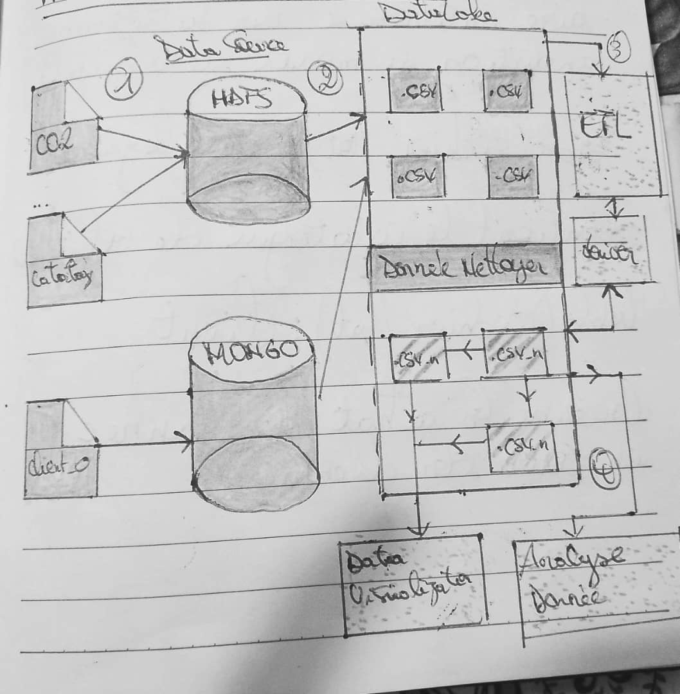

# Architecture du Système

## Composants

- **Sources** : MongoDB (`Client_0.csv`), HDFS (`Catalogue.csv`, `CO2.csv`)
- **Data Lake** : Hive
- **Nettoyage & stockage final** : PostgreSQL
- **ETL** : Full Java
- **Modèles ML** : Java (dossier `models/`)

## Pipeline

1. MongoDB ➝ HDFS (`mongo_to_hdfs.java`)
2. HDFS ➝ Hive (`import_to_hive.java`)
3. Hive ➝ CSV clean ➝ PostgreSQL (`import_to_postgres.java`)

